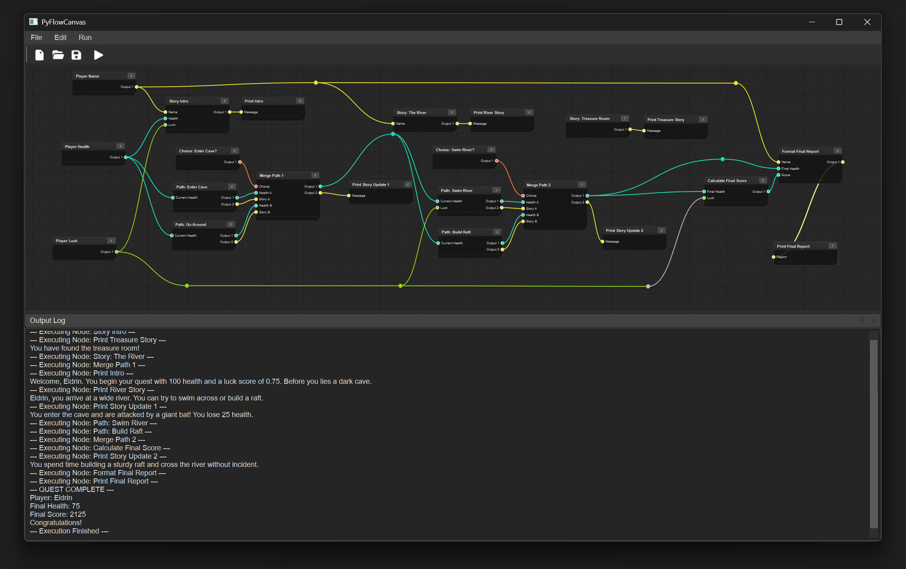
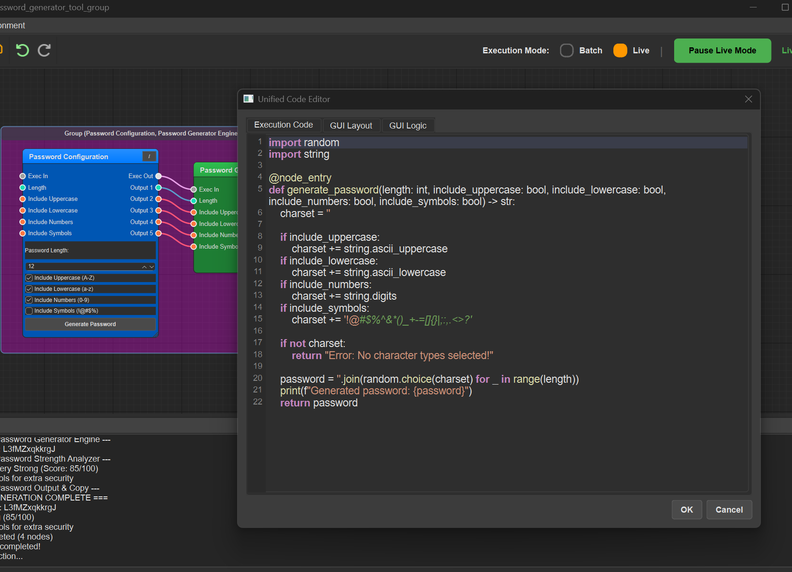

# PyFlowGraph

A universal, node-based visual scripting editor built with Python and PySide6. Dynamically create, connect, and execute any Python code as nodes in a data-driven graph.

> **Note: AI-Assisted Development Experiment**
>
> This codebase represents an evolving [AI-assisted development](https://en.wikipedia.org/wiki/Vibe_coding) experiment exploring the capabilities of modern large language models for software engineering. The project was initially architected and generated using Google's Gemini 2.5 Pro, establishing the core framework and foundational components. Development has since transitioned to leveraging Anthropic's Claude Code for ongoing enhancements, bug fixes, and feature additions. Additional AI assistance is provided through GitHub Copilot for code autocompletion and commit message generation, creating a comprehensive multi-model development ecosystem that demonstrates the collaborative potential of diverse AI tools in modern software engineering workflows.
>
> While this experimental approach has produced a functional and feature-rich application, it remains a research project focused on understanding AI-assisted code generation patterns, architectural decisions, and development methodologies. The codebase serves as a practical case study in LLM-driven software development rather than a production-ready solution.


This project is a universal implementation of a node-based Python environment. It provides a highly interactive and visually polished interface for creating, connecting, and executing custom logic nodes. The application is designed to handle any Python code, including scripts with embedded pip dependencies. The compiled application is fully self-contained and includes a portable Python runtime, so users do not need to have Python installed on their system.

The core philosophy of this editor is **"Code as Nodes."** Instead of manually adding inputs and outputs, the editor intelligently parses the Python code within each node to dynamically generate the appropriate connection pins, making graph creation fast, flexible, and intuitive.

---

## Features

* **Dynamic Node Generation**: Pins are created automatically by parsing Python function signatures within each node. Type hints (`int`, `str`, `float`, `bool`, `Tuple`) define the data type and color of each pin.
* **Blueprint-Style Navigation**:
  * **Pan**: Right-click + Drag or Middle-click + Drag.
  * **Zoom**: Mouse Wheel Scroll.
  * **Select/Move**: Left-click to select and drag nodes.
* **Data-Driven Execution Engine**: The graph executes based on data dependencies, flowing from nodes with available outputs to those that require them as inputs. No manual execution pins are needed.
* **Isolated Execution Environment**: Each node runs in its own subprocess with isolated virtual environments for maximum security and dependency management.
* **Mini-IDE Code Editor**:
  * A modal dialog provides a spacious and professional coding environment.
  * **Syntax Highlighting** for Python with custom color schemes.
  * **Line Numbering** and **Smart Auto-Indentation**.
  * **Tab support** and professional editing features.
* **Advanced Connection Management**:
  * **Reroute Nodes**: Double-click a connection to create a reroute node for better graph organization.
  * **Connection Replacement**: Dragging a new wire to an already connected input pin automatically replaces the old connection.
  * **Type-Safe Connections**: Pin colors indicate data types for visual type checking.
* **Intelligent Clipboard System**:
  * Copy (`Ctrl+C`) and paste (`Ctrl+V`) multiple nodes with preserved relationships.
  * Internal connections between copied nodes are maintained automatically.
  * Smart positioning system offsets pasted nodes based on cursor location.
* **Professional UI/UX**:
  * **Custom Dark Theme**: Consistent, modern QSS stylesheet throughout the application.
  * **Font Awesome Integration**: Professional iconography for all UI elements.
  * **Blueprint-Style Navigation**: Industry-standard node editor interaction patterns.
* **Robust Persistence**: Graphs serialize to clean JSON format with full state preservation including node positions, connections, code, and environment requirements.

---

## Screenshots

### Main Interface

The main PyFlowGraph interface showcasing a complete text adventure game implementation. This example demonstrates the node-based visual scripting approach with interconnected nodes handling game logic, user input processing, and narrative flow. Notice the clean dark theme, type-colored connection pins, and the intuitive layout of the node graph canvas.



### Mini-IDE Code Editor

The integrated Python code editor provides a professional development environment within PyFlowGraph. Features include syntax highlighting with custom color schemes, line numbering, smart auto-indentation, and tab support. The modal dialog design gives developers ample space to write and edit node logic while maintaining the visual context of the graph workflow.



### Python Environment Manager

The Python Environment Manager dialog enables sophisticated dependency management for each graph project. Users can specify custom pip requirements that are automatically installed in isolated virtual environments. This ensures each graph has its own clean dependency space, preventing conflicts between different projects while maintaining security through subprocess isolation.


---

## Project Structure

The project is organized into modular, single-responsibility Python files:

* `main.py`: The main entry point for the application. Handles application setup and loads the stylesheet.
* `dark_theme.qss`: The global Qt Style Sheet that defines the application's dark theme.
* `node_editor_window.py`: The main `QMainWindow` that hosts all UI elements.
* `node_editor_view.py`: The `QGraphicsView` responsible for rendering the scene and handling all mouse/keyboard interactions (panning, zooming, copy/paste).
* `node_graph.py`: The `QGraphicsScene` that manages all nodes, connections, and the core clipboard logic.
* `node.py`: Defines the main Node class, including its visual appearance and the logic for parsing Python code to generate pins.
* `pin.py`: Defines the input/output pins on a node.
* `connection.py`: Defines the visual Bezier curve connection between two pins.
* `reroute_node.py`: A special, simple node for organizing connections.
* `graph_executor.py`: The engine that intelligently executes the node graph based on data dependencies.
* `code_editor_dialog.py`: The modal dialog window that contains the advanced code editor.
* `python_code_editor.py`: The core code editor widget, featuring line numbers and smart indentation.
* `python_syntax_highlighter.py`: Implements syntax highlighting for the code editor.
* `color_utils.py`: Color manipulation utilities for the interface.
* `environment_manager.py`: Virtual environment management dialog for graph-specific dependencies.
* `settings_dialog.py`: Application settings configuration interface.
* `node_properties_dialog.py`: Node property editing interface.
* `run.sh` / `run.bat`: Helper scripts for running the application within its virtual environment.

---

## Running the Pre-compiled Version (Windows)

This is the easiest way to run the application without needing to install Python or any dependencies.

1. **Go to the [Releases Page](https://github.com/bhowiebkr/PyFlowCanvas/releases)** on GitHub.
2. Find the latest release and download the `.zip` file (e.g., `NodeEditor_Windows_v1.0.0.zip`).
3. **Unzip** the downloaded file to a location of your choice. This will create a new folder.
4. Open the new folder and run the `main.exe` executable.
5. To test the application, go to `File > Load Graph...` and open one of the `.json` files from the `examples` folder.

---

## Setup and Installation

1. **Clone the Repository**:

    ```bash
    git clone [https://github.com/bhowiebkr/PyFlowCanvas.git](https://github.com/bhowiebkr/PyFlowCanvas.git)
    cd PyFlowCanvas
    ```

2. **Create a Virtual Environment**:

    ```bash
    python3 -m venv venv
    ```

3. **Activate the Environment**:
    * On Linux/macOS: `source venv/bin/activate`
    * On Windows: `venv\Scripts\activate`

4. **Install Dependencies**:

    ```bash
    pip install PySide6
    ```

5. **Run the Application**:
    Use the provided scripts, which will automatically activate the environment and run the main script.

    **Linux/macOS:**
    ```bash
    ./run.sh
    ```
    
    **Windows:**
    ```cmd
    run.bat
    ```

---

## Quick Start Guide

### Basic Operations
* **Create a Node**: Right-click on the canvas and select "Add Node"
* **Edit Node Logic**: Click the "Edit Code" button on a node to open the integrated code editor
* **Connect Nodes**: Click and drag from an output pin (right side) to an input pin (left side)
* **Navigate**: 
  * **Pan**: Right-click + drag or middle-click + drag
  * **Zoom**: Mouse wheel scroll
  * **Select/Move**: Left-click to select and drag nodes
* **Delete Items**: Select any node, reroute node, or connection and press `Delete`
* **Execute Graph**: Press `F5` or use "Run > Execute Graph" menu

### Advanced Features
* **Reroute Connections**: Double-click any connection to create an organizational reroute node
* **Copy/Paste**: Use `Ctrl+C` and `Ctrl+V` to duplicate node selections with preserved connections
* **Environment Management**: Access "Run > Manage Environment" to configure pip dependencies
* **Save/Load**: Use "File" menu to save graphs as JSON or load example projects

### Testing the Application
1. Load an example: "File > Load Graph..." and select from the `examples/` folder
2. Try the `text_adventure_graph.json` for an interactive demonstration
3. Press `F5` to execute and see results in the Output Log panel

---

## Node Scripting Guide

The power of this editor comes from its function-based node definition. The editor parses the first function it finds in a node's code to determine its I/O pins.

### Defining Inputs

Inputs are defined as parameters to your function. The parameter's **name** and **type hint** are used to create the input pin.

```python
# This creates an input pin named "Input Number" of type Float.
def my_function(input_number: float):
    ...
```

### Defining Outputs

Outputs are defined by the function's **return type hint**.

**Single Output:**

```python
# This creates a single output pin named "Output 1" of type String.
def my_function(input_value: int) -> str:
    return f"The value is {input_value}"
```

**Multiple Outputs:**
Use a `Tuple` to define multiple output pins. The editor will create `output_1`, `output_2`, etc.

```python
from typing import Tuple

# Creates two output pins:
# - "Output 1" (String)
# - "Output 2" (Integer)
def my_function(input_value: str) -> Tuple[str, int]:
    return f"Processed: {input_value}", len(input_value)
```

### Helper Functions & Imports

You can define helper functions and import modules at the top level of your code. They will be available to your main node function during execution.

```python
import random

def get_random_suffix() -> str:
    return str(random.randint(100, 999))

def main_node_function(base_name: str) -> str:
    suffix = get_random_suffix()
    return f"{base_name}_{suffix}"
```

### Advanced Features

**Custom Dependencies**: Each graph can specify its own pip requirements through the Environment Manager. Dependencies are automatically installed in isolated virtual environments.

**Type Flexibility**: The editor supports any Python type through type hints for automatic pin generation. Pin colors are determined by the type annotation, providing visual type identification. Common types include:
- `int` - Integer values (blue pins)
- `str` - String values (green pins) 
- `float` - Floating point numbers (orange pins)
- `bool` - Boolean values (red pins)
- `Tuple[type, ...]` - Multiple outputs (colored by constituent types)
- Custom classes, complex data structures, and any Python object are fully supported

**Error Handling**: Node execution errors are captured and displayed in the Output Log with full stack traces for debugging.

---

## Virtual Environment Management

PyFlowGraph features advanced virtual environment management:

* **Isolated Environments**: Each graph can have its own virtual environment with custom pip dependencies
* **Automatic Management**: The application creates project-specific environments in the `venvs/` directory
* **Environment Dialog**: Use "Run > Manage Environment" to configure package dependencies for each graph
* **Security**: All node execution happens in isolated subprocess environments

---

## Example Graphs

The `examples/` directory contains sample graphs demonstrating various capabilities:

* `api_fetch_graph.json` - Web API integration example
* `fibonacci_graph.json` - Mathematical computation workflow
* `file_analyzer_graph.json` - File processing and analysis
* `meme_generator_graph.json` - Image manipulation pipeline
* `procedural_texture_graph.json` - Algorithmic texture generation
* `text_adventure_graph.json` - Interactive text-based game logic
* `weather_analysis_graph.json` - Data analysis and visualization

---

## Dependencies

* **Python 3.8+**
* **PySide6** - Qt6 framework for Python
* **Font Awesome** - Professional iconography (included in `resources/`)

---

## License

This project is licensed under the MIT License. See the `LICENSE` file for details.
